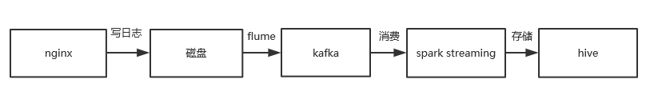

架构

处理流程
Flume会实时监控写入日志的磁盘，只要有新的日志写入，Flume就会将日志以消息的形式传递给Kafka，然后Spark Streaming实时消费消息传入Hive

预期效果
通过这套架构，收集到的日志可以及时被Flume发现传到Kafka，通过Kafka我们可以把日志用到各个地方，同一份日志可以存入Hdfs中，也可以离线进行分析，还可以实时计算，而且可以保证安全性，基本可以达到实时的要求。
